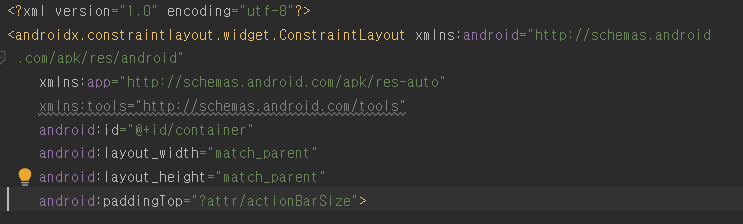

안드로이드 스튜디오 최신(5.0.0 이상)버전 부터 Bottom Navigation Activity를 생성하면 곧바로 하단바가 생겨서 편하게 사용 할 수 있는데, 이때 타이틀바아래에 흰 공간이 생겨 내용을 가려버리는 문제가 생깁니다.

 

저도 이러한 문제를 겪어 몇시간동안 삽질하다 겨우 찾아낸 해결법을 알려드리겠습니다.

 

 

위와같이 타이틀바 밑에 여백때문에 내용이 가려집니다.

 

 

   
BottomNavigationView가 있는 xml 파일에서
위 사진의 맨 아래줄의 android:padding="?attr/actionBarSize" 이 한줄만 지워주시면

 

 

이렇게 깔끔하게 해결하실 수 있답니다!..

(이문제 때문에 거의 4시간을 삽질했는데 이렇게 쉽게 해결되니 너무 허무했어요 ㅠㅠ)

 
