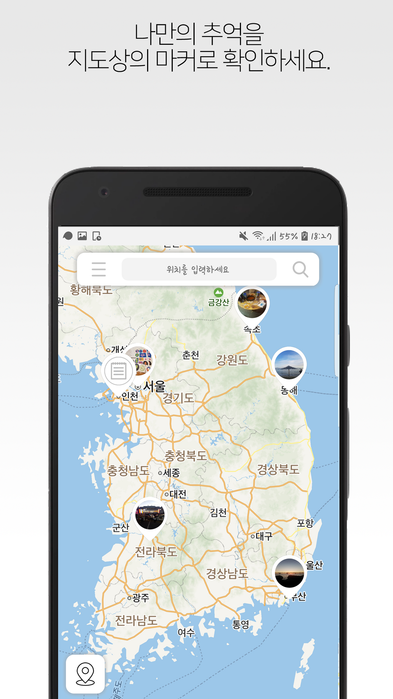
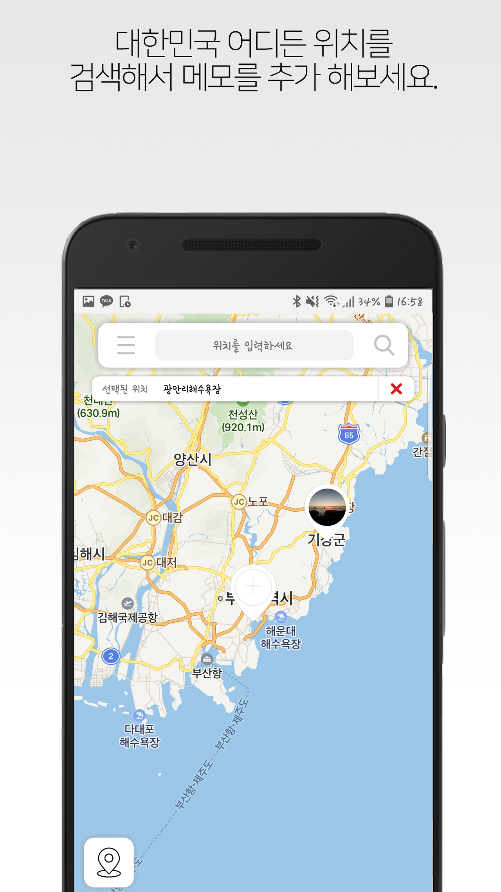
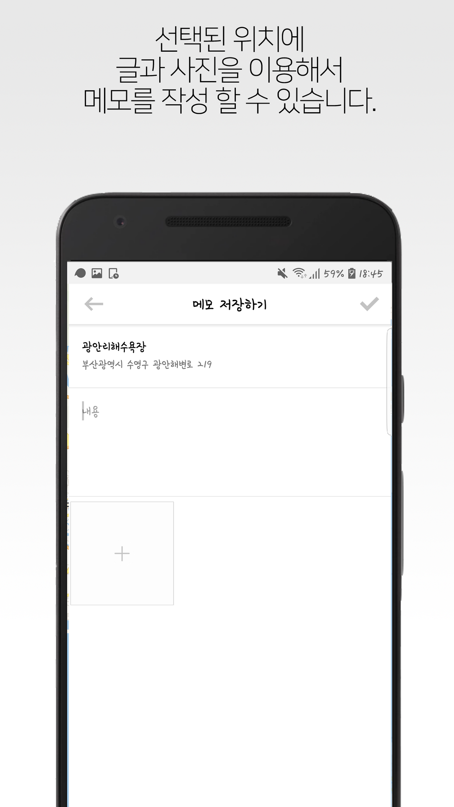
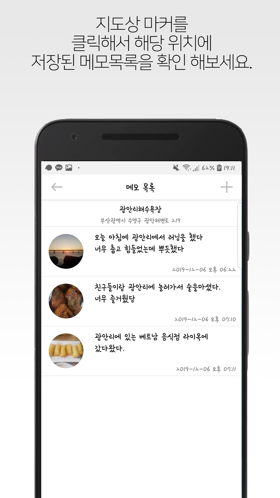
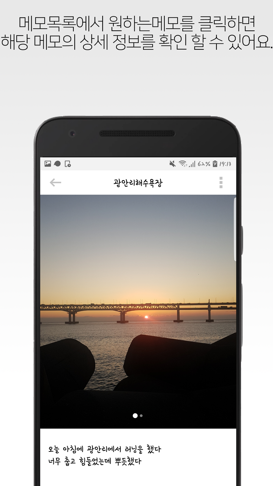

처음 안드로이드 어플을 개발한건 아니지만,
나름 완성도있게 만들고 플레이스토어에 출시까지 한 의미있는 프로젝트여서 이렇게 회고록을 남긴다.

 

## 주제 및 개발 동기
맵모장은 지도상에 특정한 위치에 대해서 글과 사진을 남길 수 있는 지도기반 메모 어플리케이션이다. 
현재 시중에 나와있는 메모 어플은 대부분 글만 저장하는 형식인데,특별한 추억이 있는 장소에 메모를 저장 할 수 있는 어플이 있으면 좋을거 같은 생각에 맵모장을 구현 하게 되었다.

 

## 앱 구성
맵모장은 정말 간단한 어플이다.
맵모장의 화면 구성은 지도가 띄워진 메인 페이지, 위치 검색 페이지, 메모 추가 페이지, 메모 상세 페이지, 메모 리스트 페이지, 내 메모 페이지 총 6개로 이루어져 있고, 자세한 사용자 설명은 아래와 같다.

- 어플을 실행하면 전국이 한눈에 다보이는 지도가 화면에 띄워지고 내부 DB에 저장되어있는 메모 정보를 불러와서 지도상에 표시된다.

- 사용자는 지도 화면 상단에서 메모를 남기고싶은 위치를 검색하고 선택하면 해당 위치에 메모를 추가할 수 있는 마커가 생성된다. 

- 사용자는 원하는 위치에 자유롭게 글과 사진을 남길 수 있고, 메모를 저장하면 해당 위치에 등록된 사진이 포함된 마커가 생성된다.

- 메모마커를 클릭하면 해당위치에 등록된 메모 리스트가 표시되고 특정 메모를 클릭하면 해당 메모 페이지로 이동해 상세 정보(모든 사진, 메모 저장 시간)를 확인 할 수 있다.

- 메모 페이지에서 사용자는 메모를 수정하거나 삭제 할 수 있다.

- 지도 화면 상단의 왼쪽 버튼을 누르면 사용자는 자신이 등록한 모든 메모 리스트를 확인 할 수 있고, 각각의 메모의 상세 정보 를 확인 할 수 있다.

 

 

 
 

## 개발 툴 - Android Studio

 

## 사용 API - Naver Map API (Mobile Dynamic Map, Search Place)

 

## 데이터베이스 - SQLite ( Android Studio 내부 DB)

 

## 개발 언어 - Java

 

## 느낀점
**1.구글에서 androidx를 사용안하면 제한을 두는걸 새삼 많이 느꼈다.** 
우선 프로젝트에 androidx를 사용안한 이유는 아래와 같다.
 
처음에 안드로이드 프로젝트를 만들때 Use androidx.* artifact 체크해제가 막혀 있어서 체크된 상태로 프로젝트를 만들었는데 이때 네이버 지도 API가 안됐었다.. androidx 때문이라고 확신할순 없었지만, 예전에 androidx를 적용하지 않은 프로젝트에선 쉽게 네이버 지도 API가 적용됐던걸 생각하고 androidx 때문이라고 생각했다.
 
그리고 정말 많은 구글링을 하고 우여곡절끝에 android sdk 버전을 내려서 androidx가 체크해제되게 만들고 새로 프로젝트를 만들었더니 네이버 지도 API를 적용 할 수 있었다. 이렇게 androidx를 쓰지않고 프로젝트를 진행해 갔다.
 
하지만.. 프로젝트 진행중에 안드로이드 내부DB가 잘되지않아 파이어베이스 데이터베이스를 알아봤는데 androidx를 사용하지 않아 최신 문서에 있는 방법으론 파이어베이스를 적용할순없었고 구글링해서 예전 적용방법을 따라했는데 잘안됐었다. 결국 다시 안드로이드 내부DB를 다시 적용했고 다행히도 잘 작동했었다.
 
또한 맵모장을 완성하고 출시 직전 google ads를 사용할려고 알아봤는데 위와 마찬가지로 실패했고 페이스북 audience network로 갈아탔다 ㅠ
 

**Kotlin이 공부하고 싶어졌다.** 
프로젝트를 진행하면서 구글링할때 의도치않게 공식문서, 개인블로그 등등에서 Kotlin을 사용한 코드를 많이봤는데
 
자바에 비해서 훨씬 간결한걸 느낄 수 있었고, 사람들도 많이 쓰는거 같았다. 따라서 다음 프로젝트는 Kotlin을 공부해서 Kotlin으로 만들어 보고 싶어졌다.
 

**Play Store URI** 
https://play.google.com/store/apps/details?id=wap.example.findintermediateapp&hl=ko 
**GitHub Repository URI** 
https://github.com/Jaeyeon2/MapMemo.git 

